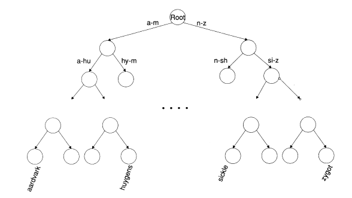
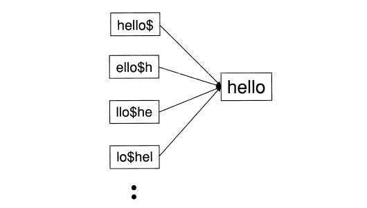
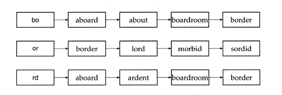

##词典搜索的数据结构

在给定倒排索引和查询，首要任务是确定查询中的各个查询词是否在词汇表中，如果在则返回该词所对应的倒排记录表的指针。词汇表的查找操作通常采用一种称之为词典的数据结构，主要有两种解决方案：**哈希表方式**和**搜索树方式**。通常在选择选用何种解决方式时，我们需要考虑如下问题：                       

* 关键字的数目    
* 关键字的数目是经常变化还是相对固定，在变化的情况下，是只插入新关键字还是同时要删除某些旧关键字。  
* 不同关键字的相对访问频率如何。   

    

<a href="#" class="btn btn-success">Success Button</a>  



     

#container {
  float: left;
  margin: 0 -240px 0 0;
  width: 100%;
}   



对于哈希表，词汇表中的每个词通过哈希函数映射成一个数，可以认为这个数代表这个词的存储地址。所以对于query里面的查询词来说，同样通过哈希函数应查看查询词映射到的地址，如果此地址存在数，则表示该查询词存在词典中。采用哈希表方式时，存在以下问题：          
    
* 哈希函数的空间要足够大，并且不易扩展。哈希函数必须要有足够大的空间来               存储字典，同时它的空间很难实时扩展，如需扩展，需要更改哈希映射函数，使得整个数据结构都发生变化。 
* 冲突问题的解决，因为哈希函数可能使得两个不同的词映射到统一地址，如何减少映射冲突也是一个要考虑的问题。   
* 哈希表方式很难解决前缀式查询，因为在不知道整体词的情况下，哈希映射函数是失效的。  

搜索树可以很好的解决上述问题，它支持前缀式查询。最出名的搜索树是二叉树，每个内部节点都有两个字节点。在二叉树中搜索词要从根节点开始，每个内部节点代表一个二值测试，测试的结果用于确定下一步应该搜索的子树。二叉树的平衡性是实现高效搜索的关键，，平衡二叉树指的是任何节点的两个子树的高度相差小于等于1.下图为一个二叉树表示的词典的例子。为了实现搜索树的平衡性，我们必须在加入增加或删除节点时对树进行处理以保持树的平衡性，这里用B-树实现。

   	

##通配符查询

通配符通常用于以下情形：    
1. 用户不确定查询查询词的拼写。   
2. 用户知道某个查询词项可能有不同的拼写版本，并且要把包含这些版本的文档都查找出来。         
3. 用户查找某个查询词项的所有变形，这些词项还做了词干还原，但是用户并不知道搜索引擎是否做了词干还原。    
4. 用户不确定一个外来词或者短语的正确拼写形式。   

当通配符出现在一个查询词的尾部时，如ca*，则是需要查找词典中所有词前两个字母是ca的所有词的文档。我们可以通过搜索树来实现这一查找，在搜索树的根（root）节点,首先我们确定首字母为c所指定的分支，而后在以分支作为搜索树查询a所对应的分支，这样这个分支下的所有单词都为符号ca*查询的单词。     
然后，当通配符出现在词的首部时，如*ay,需要查找词典中后两个字母是ay的所有词项，显然用之前的搜索树不能实现这一查询。这里我们可以引入词典的反向B-树结构。前面的词典的B-树的构建是从词项的首字母开始，接着词的第二个字母知道最后一个字母构建B-树。反向B-树恰恰相反，它是从词典的尾字母开始，依次到倒数第二个字母直到第一个字母构建B-树。这样的反向B-树便能匹配通配符出现在词首部的查询。
那么对于通配符出现在查询词中间的查询，如t*o,我们可以采用如下策略，首先用构建的B-树查找t*的所有词，而后采用构建的反向B-树查找符合*o的所有词，最后两个查询的词求交集便是所查找的词。

###轮排索引
轮排索引是一种用于一般通配符查询的索引，它是倒排索引的一种特殊方式。它的工作原理为，首先引入一终结符$，对词项集合中的每个词在其末尾增加$符号。如词项hello扩展成hello$,随后我们需要按如下方式建立词的轮排索引，对词hello$连续进行首位翻转，将出现的所有形式记录的集合称之为轮排词汇表。hello$的轮排索引如图所示:   
     
那么如何用轮排索引实现通配符查询呢，由上图我们知道轮排索引中的任何一个状态都指向词项hello，也就是说ello$h或者llo$he的查询过程都会通过轮排索引指向词项hello的查询过程。所以例如查询通配符h*llo,处理的关键是将通配符*移动到词的尾部，将h*llo转换成h*llo$,接着进行翻转得到llo$h*,接着在轮排索引中查找该字符串，我们发现llo$h*与hello词的轮排索引中的llo$he一致，所以hello是满足条件的查询结果。       
对于查询中存在多个通配符的情况，如查询（fi*mo*er）,我们可以按如下方式进行处理，首先查找er$fi*的所有结果，接着可以通过穷举法过滤出包含mo的词，这些词便是符合通配符查询的结果。 

###支持通配符查询的k-gram索引
上面介绍的轮排索引结构简单，但是在构建轮排索引的过程中，我们需要对词进行旋转并记录所有旋转的结果，这会引起存储空间的急剧增加。     

k-gram索引是如下的倒排索引机制，它将原始词典中的所有词项进行拆分，每个词项都拆分成若干个长度为k的新的词项，并根据这些新的词项构建倒排索引，如happy按照3-gram拆分成的新词词项有$ha,hap,app,ppy,py$,这里用$来对词的开始和结束进行标记。这里倒排索引的构建方式与第一章提到的略微不同，之前的倒排索引是词典是文档中经过词条化和语言话处理的所有词，而倒排记录表是这些词所出现的文档。而这里词典则是文档中的所有词根据k-gram拆分的所有新词，倒排记录表这是包含这些长度为k的新词的原始词。如3-gram的新词etr对应的倒排记录表为,词项为etr，倒排记录表为所有包含etr的词：    
 
    

那么k-gram是如何实现通配符查询的呢，如查询he*lo,是要查询首字符为he，尾字符为lo的所有词，根据3-gram索引，我们可以够找如下的布尔查询$heANDlo$,则3-gram的查询词便是所期望的
结果。k-gram索引有时也会导致非预期的结果，如查询red*,根据3-gram索引构建的布尔查询为$reANDred,其返回结果可能包含retired，但显然这个词并不符合初始期望。为了解决这一问题，我们可以引入一个后过滤的步骤，实现方式很简单，用初始的查询词与返回的词进行匹配，那些成功匹配的词便是符合要求的词。  
通配符查找往往是非常耗时的，对于单个通配符查询，我们可能要构建轮排索引或者k-gram索引来返回中间结果，并且对这中间结果要求交集来返回确切的要查找的词，最后才依据这些词通过倒排索引来查找这些词所对应的文档。    

##拼写校正
拼写校正是在用户输入某个查询词或查询短语时，用户能识别其中词的拼写错误并返回正确词的查询结果。

###拼写校正的实现

对于大多数拼写校正算法而言，有以下两条基本规则：        

* 对于一个错误拼写的查询中，则需要在其所有正确的拼写中，返回最近的正确拼写的查询。
* 当两个正确拼写查询临近度相等时，则需要返回更常见的那个正确查询。更常见可以通过以下两个方式衡量，可以统计文档集合中两个查询出现的次数，出现次数高的标记为“更常见”。也可以统计用户查询日志中两个查询的出现次数，出现次数更高的标记为"更常见"。  

###拼写校正的方法
词独立校正:不管查询是单个词还是多个词构成的短语，对查询的词的拼写校正是独立进行的，也就是说是上下文独立的，即某个词是否校正与上下文语境没有关联。校正方法主要有编辑距离方法和k-gram重合度方法。   
上下文敏感校正:则是在校正过程中，会根据上下文信息来决定词的校正。

####编辑距离

给定两个字符串S1和S2，两者的编辑距离定义为由S1转换成S2的最小编辑操作数。通常这些编辑操作包括：     
 
* 将一个字符插入字符串   
* 将一个字符从字符串中删除  
* 将字符串中的一个字符替换成另一个字符    

	

可以在O(S1*S2）的时间复杂度下计算S1和S2之间的编辑距离，主要方法是采用动态规划的思想（类似于动态规划中的求最长公共子串问题），其中S1和S2以字符数组方式进行存放。整数矩阵m的行数和列书分表代表两个字符串的长度，算法在运行过程中不断填写矩阵元素。例如，在算法结束时，m[i,j]表示S1的前i个字符和S2的前j个字符的编辑距离。其代码实现如下：
   
   
 

EditDistance(S1,S2) 
int m[|S1|,|S2|] = 0    
for i <— 1 to |S1|      
do m[i,o] = i       
for j <— 1 to |S2|      
do m[0,j] = j
for i <— 1 to |S1|      
do for j <— 1 to |S2|       
    if S1[i] == S2[j]       
        k = 1       
    else        
        k = 0       
    m[i,j] = min{m[i-1,j-1]+k,m[i-1,j]+1,m[i,j-1]+1}        
return m    

      

加入对于某个拼写错误查询q，我们需要从词典W中找出与q相邻最近的正确词项，最简单的方法是便利W中的所有词项wi，计算wi和q之间的编辑距离，最后返回和q最近编辑距离的词项wi，并返回wi所指向的文档。很显然，这种遍历的方法是十分低效的，我们可以采用如下的启发式优化策略，我们将搜索限定在首字母相同的词典词项上，对于查询q，我们认为错误不出现在首字符上，这样对于词典W，我们只计算与q有相同首字符的词项与q之间的编辑距离。当然在此基础上更复杂的方法是加入轮排索引，对于词错误拼写查询helo，忽略词的终结符$,构建词的轮排索引{helo，ohel，lohe，eloh}，对轮排索引中的每个词，按照上述的启发式规则与词典W中查找最近编辑距离的正确拼写。（个人理解）

####拼写校正中的k-gram索引

对与某一个错误拼写查询，我们可以根据之前的构建k-gram索引来实现拼写校正，过程如下：
对于错误的拼写单词，我们可以将此单词拆分成长度为k的多个字符串，并查找这些字符串所对应的倒排索引表，这些倒排索引表分别表示包含这些字符串的拼写正确的单词，这里我们认为，只要一个单词在在写倒排索引表中出现次数超过某一阀值m，则认为这个词是原错误拼写的正确拼写结果。例如错误拼写bord，其2-gram索引拆分成的新词有{$b,bo,or,rd,d$},这里去除词$b和d$,从文档集合中查找bo，or，rd对应的倒排记录表，如下所示：    

 

	
随后，我们只要遍历这些倒排记录表，找到那些在倒排记录表中出现次数高的词，便是正确的拼写词。k-gram索引的缺点像boardroom这种不可能是bord的正确拼写形式的词也会被检索出来。所以我们需要计算词汇表中词项与查询q之间的更精确的重合度计算方法。可以采用雅可比系数对先前的线性扫描合并方法进行修正。雅可比系数的计算公式是length(AandB)/length(AorB)，其中A和B分别表示查询q和词汇表词项中的k-gram集合。当扫描到词t时，计算出q和t的雅可比系数，如果系数大于某一阀值，则将词t返回。
采用雅可比系数进行验证的时候，我们需要知道q和t的k-gram索引，首先q的k-gram索引是已知的，那么在验证的过程中我们需要遍历所有q的k-gram索引中出现的词t的k-gram索引，如果穷举词t的k-gram索引是个缓慢的过程。我们可以通过一下方式来进行简化处理，当我们知道词t的长度时，可以认为他的k-gram长度为length(t)-k+1,这样能快速计算出雅可比系数。

####上下文敏感的拼写校正

当查询的短语中每个单词都是正确的单词，但是返回的查询结果很少时，我们可以认为单词中存在拼写错误，并对其中的单词查找其正确的拼写结果，并返回修正后的短语的查询结果。当采用这种穷举法对词语中的词进行拼写校正时，工作量大，效率低。这时可以采用启发式的方法通过用户的查询日志来统计最有查询短语拼写校正后最有可能出现的短语。

####参考资料
[信息检索导论-词典及容错式检索](https://www.google.com.hk/search?q=%E4%BF%A1%E6%81%AF%E6%A3%80%E7%B4%A2%E5%AF%BC%E8%AE%BA&oq=%E4%BF%A1%E6%81%AF%E6%A3%80%E7%B4%A2%E5%AF%BC%E8%AE%BA&aqs=chrome..69i57j69i65j69i61l3j0.3218j0j1&sourceid=chrome&ie=UTF-8)  
**说明：**文章主要内容和图片来自信息检索导论一书。

 

