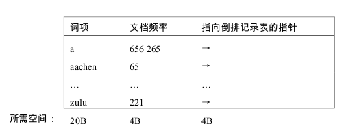
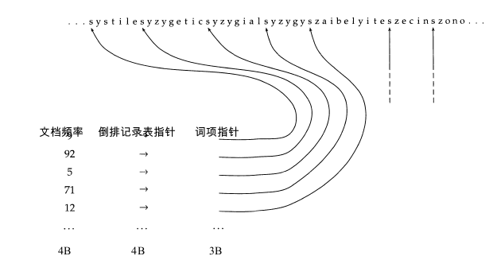
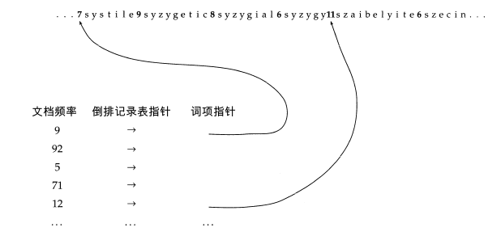
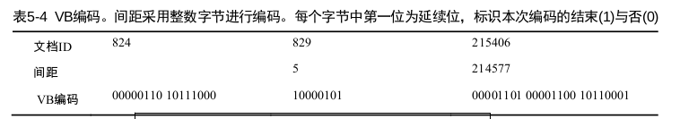
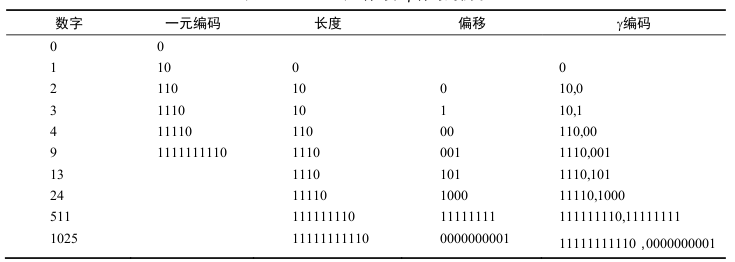

###为什么要进行索引压缩？
------
进行索引压缩有以下优点：  
 
 * 节省磁盘空间．  
 * 增加高速缓存(cache)的利用率.  
   倒排索引词典是放在内存中的，倒排记录表放在磁盘上．对与到拍记录上的某些词项ｔ，我们是需要经常访问的，如果将这次词项ｔ所对应的到拍记录表压缩后放在高速缓存中，只要采用得当的解压缩算法，那么当查询词项ｔ的倒排记录表时，只需要访问cache，而不用从磁盘读取数据，能充分减少IR系统的响应时间． 
 * 压缩能够加快从磁盘读取数据的速度．
 
压缩技术分为有损压缩和无损压缩，有损压缩指的是压缩后，原始数据的所有信息都保存下来了．词干还原，大小写转换都属于有损压缩．   
   
###Heaps定律：词项数目的估计  

heaps定律认为，文档集大小和词汇量之间存在对数上的线性关系.它将词项的数目估计为文档集大小的函数:$$M=kT^b$$,其中Ｔ代表文档集合中的词条的个数． 

不同文档集下ｋ取值差异较大，因为词汇量大小取决于文档本身以及对他进行处理的方式．当进行词干还原，大小写转换时将降低词汇量增长的速度，允许加入数字和容忍拼写错误则会增加增长率．无论参数取值如何，heaps定律满足一下两条性质：    

* 词汇量会随着文档集的增加而增加，不会趋于一个定值．     
* 大规模文档集的词汇量也会很大．       

###Zipf定律：词项在文档中的分布
Zipf定律用于估计词项在文档中分布，假设$t_1$用于表示文档集中出现最多的词，$t_2$用于表示文档集中出现第二多的词，文档集合中出现第i多的词的文档频率$cf_i$与$\frac{1}{i}$成正比:     
    $$cf_i=k\frac{1}{i}$$
    
##词典压缩
------

###为什么要进行词典压缩
理想情况下在建立好索引后，我们希望将词典存放在内存中，但是这往往很难实现，尤其是对于实用的搜索引擎和嵌入式系统．限制IR系统的响应之间的一个因素包多对磁盘的访问次数．所以，如果通过压缩来讲所有的或大部分的词典存入内存，将大大加快IR系统的响应速度．    

###将词典看作单一字符串的压缩方法  
采用如下的数据结构进行存储：一个定长的数组用于存储词项（２０Ｂ），４Ｂ的空间用于存储文档频率，４Ｂ的空间用于存储指向倒排记录表的指针．对于一个包含Ｍ个词项的文档空间来说，词典的总空间为M*(20+4+4),当Ｍ＝400,000时，占用空间为11.2MB.

这种方法存在很大的不足，首先大部分的英文词平均长度为8B,这显然造成了大部分的空间浪费，其次也存在有些词的长度超过20B,导致的结果便是不能存储这些词．

我们可以采用如下的改进措施，我们建立一个字符串在存储字典中的所有词项,4B的空间存储文档频率,4B的空间存储倒排记录表的指针，这个指针指向前面所有词典构成的长字符串，在长字符串中我们需要每一个词加入一个定位指针，用于指定下一个词的开始位置和当前词的结束位置，由于有400,000个词，每个词为８B,所以寻址空间为400,000*8=3.2*$10^6$,所以可以用一个长为$\log{3.2*10^6}$$\approx$22b，即３Ｂ的指针来表示．词典的总空间为M*(4+4+3+8)=7.6MB．    

###按块存储 
对上面的压缩方法进行一个变形，这里不再对每个词项都维护一个指向字符串(所有词的组合)的指针．我们首先将我们的词典按块进行划分，例如每５个词为一块，这样对没一个块只需要维护一个这个块指向字符串的指针，同时在长字符串中，我们需要加入一个空间用于指定当前词的长度．在这种机制下，假设一个块内有ｋ个词，我们减少了(k-1)个指针的空间，但是我们需要在字符串中对没个词增加空间以记录其词的长度．假设每个块内有４个词，减少的指针空间为9B,同时对４个词需要增加４Ｂ的空间用于记录词的长度，所以没４个词产生了5B的压缩，所以压缩的空间为400,000*$\frac{1}{4}$\*5=0.5MB.    

**注意：**我们在这里维护了两个指针，一个用于指向倒排记录表，一个指向字符串用词项的位置，我们压缩的部分是词项指针．   
  

我们发现，每个块内的词越多时，则可以压缩的空间越大．但是并非块内词越多越好，在进行词项查找时，对于块间的词我们可以通过二分查找快速定位，但是在快内查找时则是简单的线性遍历，所以我们必须在查找速度和空间压缩见进行权衡．    

##倒排记录表的压缩
---------

倒排记录表的压缩基于下面一个前提，当用文档ID来表示倒排记录表，对与高频词来说，倒排记录表中的记录多并且相邻的记录之间差距会很小，当某高频词出现在某篇文档中时，将其相近的文档中出现高频词的概率会很大．这就给我们提供了对倒排记录表进行压缩的灵感，正常情况下我们对到拍记录表中的每个文档id,都是用定长的空间来存储的，那么对那些高频词的话，我可以通过存储他们倒排记录表相邻的距离（明显小于存储文档id的长度）来达到压缩的目的．     

###可变字节码
VB(Variable byte,可变字节)码的思想为，我们采用整数个字节来存储文档id,每个字节的后７位为有效编码，第一位为延续位，表示本次编码的结束与否,'1'表示结束．     

可变字节码的解码过程如下，根据延续位（一直获取字节直到字节的首位为１）来获取编码结果，对编码结果进行以下处理，去除所有的延续位，剩余有效编码表示间隔位，将此编码值与前一个编码的结果进行累加即表示文档的ID. 

###γ编码  

一元编码：将数值为ｎ的数用ｎ个１并在之后加上一个０来表示的编码方式．  
   
γ编码主要由两部分组成，偏移量(offset)和长度(length)．长度是数组的二进制编码，但是去除了首位１，长度则是偏移量的长度，但是是通过一元编码的方式实现．对于数值5,二进制编码是101,去掉首位的１，其偏移量是01,偏移量长度为２，则由一元编码表示为110,所以数值５的γ编码为11001.

我们发现对数值为Ｋ的数进行二进制编码，其偏移量的长度为$\lfloor\log{k}\rfloor$,其长度的长度为$\lfloor\log{k}\rfloor$+1,所以，数的γ编码长度为２$\lfloor\log{k}\rfloor$＋１．      

有一点不太明白的是采用γ编码是如何实现数据压缩的呢？书的原文是这么说的：        

按上面理解，采用ｎ为进行进行表示，那么间距在1~$2^\left(n-1\right)－１$之间都将产生浪费，并在在间距为$2^n$时不能表示．

我的理解是这样的，我们有对倒排记录表的实现一般也是通过链表或是定长数组来实现的，当采用定长的编码格式来存储每个文档ＩＤ时，必然会产生很大的浪费．那么如何通过变长的编码格式并且不需要额外的数组或指针来表明文档的长度，这边是γ编码所做的事了，让我们看一下γ编码的的解码过程：11001,我们首先遍历该编码，知道遇到０时停止，发现长度为２，剩下的偏移量为01,我们知道实际的二进制数为101,也就是说我们通过编码本身可以确定文档id,不需要进行额外的存储．

####参考资料
[索引压缩](https://www.google.com.hk/search?q=%E4%BF%A1%E6%81%AF%E6%A3%80%E7%B4%A2%E5%AF%BC%E8%AE%BA&oq=%E4%BF%A1%E6%81%AF%E6%A3%80%E7%B4%A2%E5%AF%BC%E8%AE%BA&aqs=chrome..69i57j69i65j69i61l3j0.3218j0j1&sourceid=chrome&ie=UTF-8)       
**说明：**文章主要内容和图片来自信息检索导论一书。

