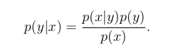
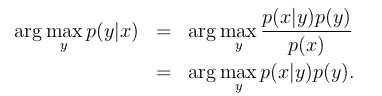
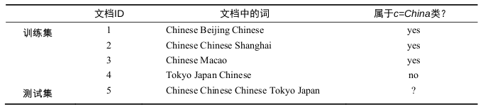

##定义
--------
>生成方法由数据学习联合概率分布P(x,y)，然后求出条件概率分布P(y｜ｘ)作为预测的模
>型，即成生模型:    
>   
>这样的方法成为生成方法，是因为模型表示了给定输入ｘ产生输出ｙ的生成关系．典型的生成模型有，朴素贝叶斯和隐马尔可夫模型．    
>判别方法是由数据直接学习决策函数ｆ(x)或者条件概率分布P(y｜x)作为预测的模型，即判别模型，判别方法关心的是对给定的输入x,应该预测什么样的输出ｙ，典型的方法包括感知机，决策树，逻辑回归．   

##理解
-----
在面对猫狗分类问题时，我们该如何实现呢？    
方法一：当我们利用逻辑回归或是感知机模型时，我们需要数据集所投射的空间中，找到一个决策边界，在决策边界一边的属于一类动物，在决策边界另一边的属于另一种动物．当来一个我们不知道的动物时，我们将它放入空间中，通过判断它在决策边界的那一侧来判断是猫还是狗．   
方法二：将数据集中的猫都拿出来，建立一个关于猫的特征的模型．按同样的方法建立一个关于狗的模型．这样，当判断一个动物时，我们分别查看它在猫模型中属于猫的概率和在狗模型中属于狗的概率，哪个值大，便说明属于哪个模型．   

方法一通过对数据集训练出一个模型，并通过判断P(y|x)下的条件概率来判断ｙ的类别．这种方法成为判别方法，对应建立的模型属于判别模型．     
方法二对数据集的每一个类别建立一个模型，并通过联合概率P(x,y)来判断ｘ特征所应对应的类别．这种方法成为生成方法．  

其实通过联合概率来判断类别进行了一个变形，一般我们是要判断P(y|x)下的概率，可以进行如下转换：   
    
对于某个参数ｘ，其概率值P(x)值在所有类别下都是相同的，所以问题便等同于如下问题：              
        

不妨通过一个朴素贝叶斯生成模型来了解生成模型的判定过程．
如图，训练集包含４篇文档，我们需要验证测试集中的文档类别：   
    

我们需要计算每一个类别下P(x｜y)P(y)的概率，并且概率最大的那一类便是文档所属类别．即计算P((Chinese,chinese,Chinese,Tokyo,Japan)｜y=c)P(y=c)和P((Chinese,chinese,Chinese,Tokyo,Japan)｜y=$\bar{c}$)P(y=$\bar{c}$)．

之后利用朴素贝叶斯的的条件独立定义进行求解便能获知测试及属于哪个类别．
 

