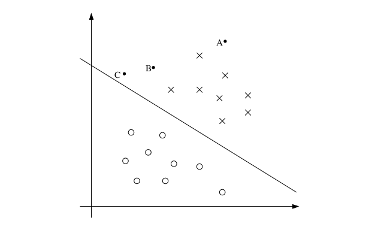

##问题引出
--------------
在面对一个最简单的二分类问题，并且假设数据集可分的情况下．具体如下图所示．当我们采用逻辑回归实现分类时，我们用一个分类超平面（决策边界）对数据进行数据进行划分，并在划分后，不同类别的数据分布在分类超平面的两边，这分类成功．其实，在数据可分的情况下，我们发现可以有很多条这样的分类超平面，并且都能达到正确分类的效果,这个时候我们可能要问，这些分类超平面的效果一样吗？是否存在一个最优的分类超平面．

##函数间隔和几何间隔     
--------------

###函数间隔     

对于上面数据集，我们计算出了一个超平面$w^Tx+b=1$.对于某一个数据点x我们需要判断其内别,如果$w^Tx+b＞0$，则其类ｙ=1，并且如果$w^Tx+b＞0$并且$w^Tx+b$值越大，则这个点的类别为正例的置信度就越高．当$w^Tx+b＜0$时,点所属类别为－１，并且$w^Tx+b$值越小，这这个点类别为负例的置信度就越高．并且当点ｘ被正确分类时，$y(w^T+b)$为正数．从上面图中可以看出，我们设定分类超平面的上部为正例，A,B,C三个的点都被标记为正例，但是C离决策边界最近，可能稍微变化决策边界就可能导致分类错误，所以C分类正确的置信读低．A离决策边界最远，所以Ｃ被分为正例的置信读高.对于点$\left(x^\left(i\right),y^\left(i\right)\right)$为了获得更好的分类效果，我们希望$y\left(i\right)(w^Tx+b)$尽量大，则分类的置信度就越高．

所以，对数据$\left(x^\left(i\right),y^\left(i\right)\right)$，我们就定义$y\left(i\right)(w^Tx+b)$为此数据点的函数间隔，并且如果使得每个点的函数间隔都倾向于一个大值，则分类置信度越高，分类效果越好．   

给定训练集合S={($x^\left(i\right),y^\left(i\right)）$,i=1,...m},我们需要计算每一个样本点到分类超平面的几何距离.在这里，我们需要求出最小的几何距离，并且通过修改分类超平面使得最小几何距离尽可能大，则分类效果更好．        
$$\widehat{\gamma}=\min_{i=1,...,m}\widehat\gamma^\left(i\right)$$  

利用函数间隔来衡量分类效果的置信度有一个缺陷，当我们确定某一个分类超平面$w^Tx+b=0$，我们对ｗ,b同时增加ｋ倍,函数间隔由原来的$y\left(w^Tx+b\right)$变成$ky\left(w^Tx+b\right)$．也就是说某一数据点的函数间隔可以可以任意的缩放或增加．

###几何间隔      

在确定分类超平面之后，任一数据点到分类超平面的距离应该是不变的．如果我们用这个距离来衡量分类置信度的话，效果会很好．      
    
点A到平面的距离设为$\gamma$,知道分类超平面的法向量为ｗ，那么将A投影到分类超平面上的点B的坐标为$x-\frac{w}{\left|w\right|}\gamma$,$w^Tx+b=0$上，所以有:        
$$w^T\left(x-\frac{w}{\left|w\right|}\gamma\right)+b=0$$
求解得$\gamma=\frac{w}{|w|}x+\frac{b}{|w|}$,所以对所有的样本点点$\left(x^\left(i\right),y^\left(i\right)\right)$,我们求得每个样本点的几何边界为:       
$$\gamma^\left(i\right)=y^\left(i\right)\left(\frac{w}{|w|}x^\left(i\right)+\frac{b}{|w|}\right)$$

给定训练集合S={($x^\left(i\right),y^\left(i\right)）$,i=1,...m},我们需要计算每一个样本点到分类超平面的几何距离.在这里，我们需要求出最小的几何距离，并且通过修改分类超平面使得最小几何距离尽可能大，则分类效果更好．        
$$\gamma=\min_{i=1,...,m}\gamma^\left(i\right)$$    

##最优间隔分类器    

当给定训练集之后，按照前面分析直观上最好的分类效果是找到决策边界使得(几何)间隔最大化.因为我们的决策是使得最小几何间隔最大化，则显然对所有点的分类的置信度很高．所以当对于一个线性可分的数据集，我们要通过一个分类超平面来分割所有的正例和负例．那么我们的问题可以转化成下面的优化问题:   
$$\max_{\gamma,w,b}   \gamma \\
 s.t.    y^\left(i\right)\left(\frac{w}{|w|}x^\left(i\right)+\frac{b}{|w|}\right)\geq\gamma,i=1,...,m
$$      
由于我们知道在确定了(w,b)之后，我们可以通过同比例的缩放或增加(w,b),所以我们可以通过相应的扩张比例使得|w|的值为１．所以优化问题转化成如下形式：     
$$\max_{\gamma,w,b}   \gamma \\
 s.t.    y^\left(i\right)\left(wx^\left(i\right)+b\right)\geq\gamma,i=1,...,m　\\
 |w|=1
$$  

通过约束|w|=1,使得函数间隔等于几何间隔．但是因为如上的优化问题是非凸问题，我们很难通过软件来进行求解．所以我们将第一个问题转化成如下问题:     

$$\max_{\gamma,w,b}:  \frac{\widehat\gamma}{|w|} \\
 s.t.    y^\left(i\right)\left(wx^\left(i\right)+b\right)\geq\widehat\gamma,i=1,...,m
$$      
其中$\widehat\gamma$代表的是最小函数间隔，我们知道函数间隔是可以通过(w,b)的同比例变化而变化，这里为了为了简化计算，我们将$\widehat\gamma$设为１．那么如上的优化问题变为:   
$$\max_{\gamma,w,b}:  \frac{1}{|w|} \\
 s.t.    y^\left(i\right)\left(wx^\left(i\right)+b\right)\geq 1,i=1,...,m
$$
进一步转变，优化问题变成如下格式：      
$$\min_{\gamma,w,b}: \frac{1}{2}w^2 \\
 s.t.    y^\left(i\right)\left(wx^\left(i\right)+b\right)\geq 1,i=1,...,m
$$

##拉格朗日算子  

对于如下的原始优化问题：        
$$ \min_w:f(w) \\
s.t.:g_i(w)\leq0,i=1,...k  \\
h_i(w)=0,i=1,...l   
$$      
其拉格朗日算子为$L(w,\alpha,\beta)=f(w)+\sum_\left(i=1\right)^k\alpha_ig_i(w)+\sum_\left(i=1\right)^l\beta_ih_i(w)
$,其中$\alpha_i,\beta_i$为拉格朗日乘数．        
考虑如下等式：  
$$\theta_p(w)=\max_\left(\alpha,\beta:\alpha_i\geq0\right)L(w,\alpha,\beta)$$    
其中ｐ表示原始的,我们发现当给定ｗ，并且ｗ满足我们原始问题的约束（$g_i(w)\leq0，h_i(w)=0$），如果ｗ违背这些约束，则显然$\theta_p(w)=\infty$,当ｗ满足原始问题约束时，$\theta_p(w)=０$．那么可以的出如下结论：        
$$\min_w\theta_p(w)=\min_w\max_\left(\alpha,\beta:\alpha_i\geq0\right)L(w,\alpha,\beta)$$    
同时我们定义$p^*=\min_w\theta_p(w)$为原始问题的解．     
现在对应它的对偶问题：
$$\max_\left(\alpha,\beta:\alpha_i\geq0\right)\theta_d(p)=\max_\left(\alpha,\beta:\alpha_i\geq0\right)\min_wL(w,\alpha,\beta)$$   
我们知道，最大最小问题的解小于最小最大问题的解：        
$$d^*=\max_\left(\alpha,\beta:\alpha_i\geq0\right)\min_wL(w,\alpha,\beta)\leq\min_w\max_\left(\alpha,\beta:\alpha_i\geq0\right)L(w,\alpha,\beta)=p^*$$    

当ｆ和$g_i$为凸函数时，$h_i$为仿射函数(仿射变换的定义是在几何空间中，一个向量空间进行一次线性变换并接上一个平移，变换成另一个向量空间)，有$d^＊=p^＊$，在这些约束下，一定存在一个$w^＊$是原始问题的解，$\alpha^＊,\beta^＊$是对偶问题的解，并且有$d^＊=p^＊=L(w^＊,\alpha^＊,\beta^＊)$,同时这３个参数满足KKT条件，KKT条件描述如下：      

其中第三个约束称为对偶互补条件，并且当$a_i＞０$时，$g_i(w^*)=0$,满足这些条件的点所对应的几何间隔便是最小几何间隔．这些点称为支持向量.

现在回到优化边界分类器部分,我们的原始问题定义为：       
$$\min_{\gamma,w,b}: \frac{1}{2}w^2 \\
 s.t.    y^\left(i\right)\left(wx^\left(i\right)+b\right)\geq 1,i=1,...,m
$$      
约束条件可以表示为：        
$$g_i(w)=-y^\left(i\right)(w^Tx\left(i\right)+b)+1\leq0$$    
    

我们可以看到，有最小几何间隔的点离决策边界最近．我们知道这些点$\left(x^\left(i\right),y\left(i\right)\right)$满足$g_i(w)=0$.我们将这些点称之为支持向量．从上图知道，数据集中有３个支持向量，一般来说支持向量的个数会明显小于数据集的大小，这在后面会相当有用．      

原始问题的拉格朗日算子可以表示为：      
$$L(w,b,\alpha)=\frac{1}{2}w^2-\sum_{i=1}^m\alpha_i[y^\left(i\right)(w^Tx\left(i\right)+b)+1]$$
这个时候我们通过求对偶问题$\theta_p(w)$来求原始问题的解．具体方法是对Ｌ函数关于参数ｗ和ｂ求偏导数：      

        
将得到的约束代回到上面的拉格朗日算子中．得到：            

        
最后原始问题的对偶优化问题可以定义为：              

现在假定我们已经求得对偶问题最优解的$\alpha_i$，那么我们是如何做预测的呢？对于一个新的数据点ｘ，我们知道预测是通过判断$w^Tx+b$的值来判定的，如果大于０，类别为正例，如果小于０，类别为负例,我们将上面求解的ｗ值代入：           

我们知道$\alpha_i\geq0$,且根据KKT约束条件中的对偶互补条件$\alpha_ig_i(w)\geq0$,并且$\alpha>0$时，$g_i(w)=0$,表示这些点有最小的几何间隔，也就是说这些点表示支持向量．我们知道，在判断ｘ类别的时候，我们只需要考虑$\alpha_i>0$的情况，也对应的我们只需要考虑数据集中的支持向量．同时，支持向量想对于数据集来说是小很多的．这样很显然可以进行高效求解.

