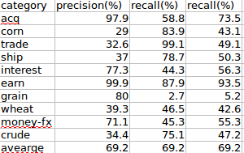
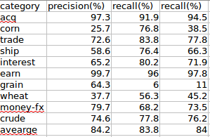
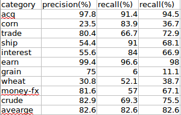
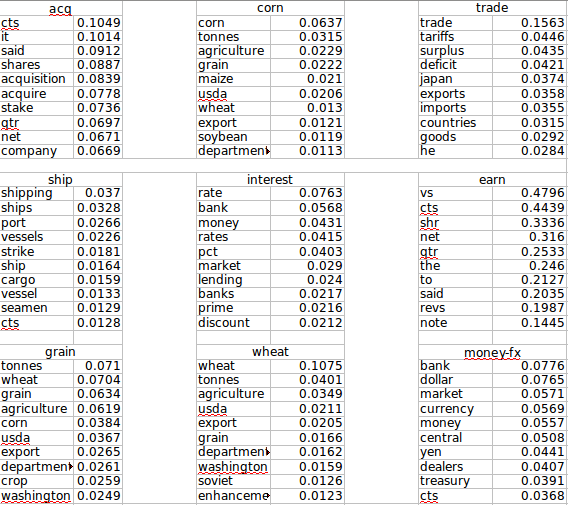
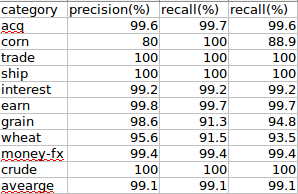
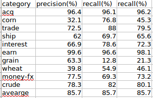

文本分类问题在机器学习和信息检索领域都有比较广泛的运用．这里将主要介绍自己实现的一些分类模型和实践过程中应该注意的地方．

##朴素贝叶斯
-----------

朴素贝叶斯模型在很多问题的处理过程中都相当有效，因为其过程和想法都很简单，只需要对数据集进行处理而不存在训练的过程，在很多场合下都作为解决问题的一个基线.

对于某一文本x,x表示文本的所有词，我们需要求文档所属的类别p(y｜x),我们可以进行如下转换:

$$ p(y｜x) = \frac{p(x,y)}{p(x)} ＝arg\max_yp(x｜y)P(y)　\\
          =arg\max_y\prod^n_\left(i=1\right)p(x_i｜y)P(y)
$$

公式从第一步到第二步我们做了一个假设，也就是说在给定ｙ的情况下，$x_i$的出现与否对$x_j$的出现与否没有影响，即：        
$$p(x_j|x_i,y)=P(x_j|y)$$

在实现朴素贝叶斯方法有两种操作，一种是贝努利模型，一种是事件模型，下面分开讨论.

**注意：**在计算$arg\max_y\prod^n_\left(i=1\right)p(x_i｜y)$因为分母很大，经常会出现数据过小超出所能表示的范围而使得结果为０，这里有两种处理方法:        

* 上式中分母一般为某一类别下文档数和文档类别的累加（平滑）或某一类别下文档的词数和词典大小的累加，我们可以初始设定每次都用一个常熟(100或1000)来代某一类别i的分母，而后其余类别，其分母则可以表示为100*(文档ｊ对应的词数)／（文档ｉ类别的词数）.              
*　也可以对上述公式$$arg\max_y\prod^n_\left(i=1\right)p(x_i｜y)P(y)$$       
转换成对数公式$arg\max_y\sum^n_\left(i=1\right)\log{p(x_i｜y)}+\log{P(y)}$来进行求解.

###贝努利模型

我们用ｘ来表示文档，那么对文档中的词，只要出现，无论出现多少次，我们都标记词的出现次数为１．可以认为贝努利模型对文档进行了单词的去重操作.如文档为＂i like you,you like me＂，那么ｘ为{i,like,you,me}     

在进行文档处理的时候，我们应该进行词条化，去除标点符号，这里我用nltk工具包进行了词的小写处理.（实验数据是路透社的新闻语料）．下图为贝努利模型下朴素贝叶斯的分类结果. 

    

 

###事件模型

正常情况下，文档中有些词是出现多次的，对于这些词，我们不单考虑词是否出现，并且在计算的过程中考虑词出现的次数，这便是朴素贝叶斯的事件模型，这个时候的词可以表示为{$word_i:count_i,...,word_n:count_n$},上面的文档用事件模型应该表示为{i:1,like:2,you:2,me:1}.下图为事件模型下朴素贝叶斯的分类结果.        
        
        
        
     

在次基础上，对文档进行取出停用词操作，分类结果如下：      

      

发现比不去除停用词效果差一些，正常情况下停用词大多数文档中出现频率较高的无意义词，这些次对表现文档主旨是没有很大作用的，但是取出停用词可能会使得所要表达的语义不一致．      

####拉普拉斯平滑

我们在计算$p(x_i｜y)$的时候，如果在某一类被$y_i$中，词$x_i$没有在任何一篇文档中出现，那么显然属于此类别的概率为０．并且我们知道已经标记好的训练集不可能涵盖所有的词，所以这种情况出现的概率很高．这里我们一般运用拉普拉斯平滑来处理. 
所以$p(x_i｜y)=\frac{count(x_i)+1}{count(allwords)+v}$.      

当我们使用贝努利模型的时候，$count(x_i)$表示在训练集类别ｙ的所有文档中出现词$x_i$的文档个数，$count(allwords)$表示类别ｙ的所有文档中词典的大小（文档所有词去重）.V表示类别ｙ的文档的大小．      

当使用事件模型的时候，$count(x_i)$表示在训练集类别ｙ的所有文档中出现词$x_i$的次数，$count(allwords)$表示类别ｙ的所有文档中总共的词数（不去重）.V表示类别ｙ的文档的词典的大小．      

###总结

我们发现，采用朴素贝叶斯模型的分类效果还不错，在事件模型下F_1值能达到83%．但是贝努利模型和事件模型的效果差别比较大，并且在不同类别上的分类效果上差别比较大．我们知道事件模型考虑到了文档中词出现的次数，这是造成差异的原因，文档中的词不能单纯的只考虑词是否出现，文档中词出现的次数对文档主旨和类别的贡献还是有很大差异的．尤其是在长文档中，词频繁出现的概率会很大，所以采用贝努利模型的话会造成很大的误差．      

##特征选择
-----------------

当我们想实现如逻辑回归，支持向量机这一类算法的时候，我们发现我们需要考虑关于如何表示文档的问题．在朴素贝叶斯中我们对每个文档只要维护他的词表，或是词－出现次数词典．而在逻辑回归模型中我们知道特征大多是一个定长向量的来表示的．        

###向量空间模型

当我们想表述一个事物时，我们会获得这个事物的若干特征，当我们获得一个事物集合时，我们可以知道这个事物集合的所有特征ｆ，那么我们便建立长度为length（ｆ）一个向量,其中向量中的每一维表示一个特征．那么当我们描述一个事物时，则初始化一个长度为ｆ的向量，并将事物出现的特征添加到向量中去.     

例如，给我们一个文档语料的训练集，这个训练集的词典长度为2000，所以我们可以建立一个长为2000的向量来表示一篇文档，当然向量的每一维和每个单词是对应的（对应关系可以自己设定，如向量的第一位表示词ｉ,向量的第二个词表示you...）,当文档为｛you i you｝是，则文档响亮可以表示为[1,2,0...]         

当用向量空间模型表示文档的时候，有以下两个问题：        

- 有些词只在测试集中出现而不在训练集中出现，我们知道向量是根据训练集中的词数目来建立的．所以只在测试集中出现的词不能在向量中表示(在朴素贝叶斯中通过平滑方法解决).     
- 当我们表示一篇文档时，文档中的词会比训练集的词典的词少很多．也就是说我们用向量表示文档时，文档中会出现很多0,这种现象称之为稀疏化．稀疏化在模型训练过程中会对训练结果产生很大的影响．同时，向量过为稀疏的话，我们将耗费大量空间来表示这些文档．并且将这些文档在内存中处理的时候，很容易导致内存溢出．如对于路透社7MB的新闻语料，词典长度为22818,用向量空间表示这些文档时，所耗费的空间为650MB.       

我们知道，训练集很难涵盖所有的特征，所以这个问题也很难解决．我们可以假设我们的训练集总够完善，则测试集中出现的新词的概率很小，对文档类别贡献很小，所以可以直接不考虑这些词．      
第二个问题我们可以采用主成分分析(pca)进行降维，这里我们主要考虑一些常用的特征抽选择方法．

特征选择有以下两个目的:        

1 通过减小有效的词汇空间来提高分类器训练和应用的效率．        
2 特征选择能够去除噪音特征，从而提高分类的精度．　

###互信息

一个常用的计算互信息的方法是计算词项t和类别c的MI(expected mutual information,期望互信息)作为A(t,c).MI度量的是词项的存在与否的给类别c的正确判断所带来的信息.MI的形式化定义如下：     

$$I(U;C) = \sum_\left(e_t\in{0,1}\right)\sum_\left(e_c\in{0,1}\right)P{(U=e_t,C=e_c)}\log\frac{P(U=e^t,C=e_c)}{P(U=e_t)P{(C=e_c)}}$$        

其中，Ｕ是一个二值随机变量，当文档包含词项t时，$e_t=1$,否则取值为0．而c也是一个二值随机变量，当文档属于类别c时，$e_c=1$,否则为0.     
当我们采用MLE(maximize likehood estimate，极大似然估计),公式等价于:      

$$I(U;C)=\frac{N_{11}}{N}\log\frac{NN_{11}}{N_1N_1}+\frac{N_{01}}{N}\log\frac{NN_{01}}{N_0N_1}+\frac{N_{10}}{N}\log\frac{NN_{10}}{N_1N_0}+\frac{N_{00}}{N}\log\frac{NN_{00}}{N_0N_0}$$      

其实可以这么理解，$N_11$表示的是类别为正例，且词项出现的文档数目，而对数中的$N_1N_1$表示的是类别问正例的文档数和词项在文档中出现的文档数，为了简化，表示符号一样，但是前者用于表示类别，后者用于表示词项．        

同时，我们可以用熵来表示互信息，他是指两个信息之间的相关性.两个时间X和Y的互信息定义为：       
I(X;Y) = H(X) - H(X｜Y)=H(Y) - H(Y｜X) = H(Y)+H(X) - H(X,Y)

对每个类别用互信息最高的抽取10个词,结果如下：        

我们可以发现，每个类别下的词与此类别都是很相关的．      

在实验过程中我们对每个类别取用互信息最高100个词进行特征，这里采用贝努利事件模型进行训练，分类结果如下：      

发现F_1值有了很大的提升，也就是说互信息在特这个选择的时候可以良好的去除噪声特征．并且极大的提高了运行效率．     

等等，结果好像不对，分类效果会有提升，但是不会提升这么多.检查代码后确实发现了错误，我们知道我们用对每个类别用互信息选择出了k个词，那么我们在朴素贝叶斯的计算过程如何表示文档呢？这个时候我们应该确定一点的就是我们的特征（词）应该是每个类别的k个词所组成的并集，所以我们在对训练集和测试集中的文档进行特征选择时，我们的参考系应该是所有类别的k个词组成的并集，而不能是某个类别的词。这点要注意...       

    
下面是每个类别抽取互信息最高的特征词采用朴素贝叶斯事件模型的分类效果。       

|特征数    |F_1值(%)|      
|:---|:---:|        
|10|  79.4|
|20|80.4|
|50|82.1|
|100|85.0|
|500|85.5|   

###$X^2$统计量

在统计学中，$X^2$统计量常常用于检测两个事件的独立性。两个事件A和B独立，是指A和B两个事件的概率满足P(AB)=P(A)P(B)或者P(B|A)=P(B).在特征选择中，两个事件分别表示词项的出现和类别的出现。此时我们按照如下公式计算：       
$$X^2(D,t,c)=\sum_{e_t\in{0,1}}\sum_{e_c\in{0,1}}\frac{(N_{e_te_c}-E_{e_te_c})^2}{E_{e_te_c}}$$     

$X^2$度量的是期望值N和观测值E的偏离程度。$X^2$统计量大则意味着独立性假设不成立，此时期望值和观测值相差不大。如果两个事件独立，那么词项的出现也会使得某个类别的出现更加可能或更加不可能，因此它适合于作为特征被选出来。这就是$X^2$特征选择方法的基本原理。       

如P($X^2$>6.63)<0.01,也就是说如果两个事件的$X^2$统计量大于6.63,那么有99%的可能性来拒绝两个事件的独立性假设。      

我们用P($X^2$>6.63)<0.01来做特征选择，采用朴素贝叶斯时间模型的分类效果如下： 

###基于频度的特征选择方法

基于频度的特征选择方法是选择那些在类别中出现频率较高的词项作为特征，这里的频度可以定义为文档频率(类别c中包含词项t的文档数目)或文档集频率(类别c中所包含的文档中t出现的总次数)，文档频率适合于贝努利模型，而文档集频率更适合于多项式模型。

这里要注意一点，我们知道在用互信息或卡方检验来实现特征抽取时，我们的参考点是类别c和词项t之间的关系，也就是说对文档集来说可能有多个类别，每个类别都维护一个词典，那么现在便是对每个类别及这个类别中的词典中的词来计算互信息或卡方统计量，并且将每个类别中取出一些特征最后所有这些特征进行融合，组成整个文档的特征。那我们用频率统计的时候，便不用这么麻烦了，我们需要维护整个文档集的词典，并且在整个文档集下进行计算，找出频度最高的k个词作为文档集的特征。

采用基于文档频率的方法可能会将很多常用词当作特征抽取出现，但是这些词对类别的贡献很小，如i,he，she，如果对文档进行那个预处理，去除停用词后在用基于频度的方法选取特征，效果会更好。		

###信息增益

熵是随机变量不确定性的度量，设X是一个取有限个值的离散随机变量，其概率分布为：		

$$P(X=x_i)=P_i,i=1,2,...,n$$		

则随机变量X的熵定义为：		

$$H(X)=-\sum_{i=1}^np_i\log(p_i)$$		

若$p_i=0$,则定义$0log0=0$,熵只依赖于X的分布，与X的取值无关。熵越大，随机变量的不确定性就越大。条件熵H(Y｜X)表示在已知随机变量X的条件下Y的不确定性，随机变量X给定条件下Y的条件熵H（Y｜X）定义为X给定条件下Y的概率分布的熵对X的数学期望。

$$H(Y｜X)=\sum_{i=1}^np_iH(Y｜X=x_i),这里p_i=P(X=x_i),i=1,2...n$$

信息增益（information gain）表示得知X的特征信息而使得类Y的信息不确定性减少的程度。		

特征A对训练数据集D的信息增益g(D,A)，定义为数据集D的经验熵H(D)与特征A给定条件下的经验条件熵H(D｜A)之差，即：			

$$g(D,A)=H(D)-H(D｜A)$$  
    
具体到文本分类过程中某一词项ｔ的信息增益可以表述为：      

$$H(C｜t)=P_tH(C｜t)+P_{\negt}H(C｜t) \\
        =-P_t\sum_{i=1}^{k}P(C_i｜t)-P_{\negt}\sum_{i=1}{k}P(C_i｜\neg{t})$$

