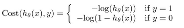
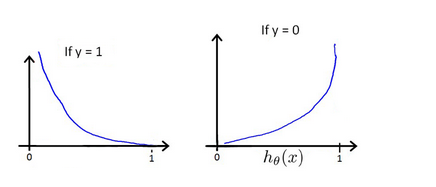
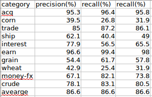

对于逻辑回归函数，我们的假设方程为：		

$$h_\theta(x)=g(\theta^Tx)=\frac{1}{1+e^{-\theta^Tx}}$$		

其中，$g(z)=\frac{1}{1+e^{-z}}$称之为sigmoid函数。		

那么为什么要在逻辑回归里使用sigmoid函数呢，观察逻辑回归的假设方程可以发现，如果没有使用sigmoid函数，假设方程与线性回归的假设方程是一样的。但是很显然，线性回归的假设方程的值域为$(-\infty,+\infty)$,而二分类问题一般去之都是固定的值{0,1}.这个时候我们可以使用sigmoid函数，它的作用相当与实现了一个映射，将$(-\infty,+\infty)$值域映射到（0,1）之间。		

我们假定：	
$$P(Y=1｜Ｘ;\theta)=h_\theta(x) \\
	P(Y=0｜Ｘ;\theta)=1-h_\theta(x)$$	

上面公式我们可以合并成：		

$$P(Y｜Ｘ;\theta)=(h_\theta(x))^y(1-h_\theta(x))^{1-y} $$		   

假设有ｍ个训练集并且相互独立，这参数的似然方程可以表述为：		

$$L(\theta)=p(y｜x;\theta) \\
		   =\prod_{i=1}^mP(y^{(i)}｜x^{(i)};\theta) \\
		   =\prod_{i=1}^m(h_\theta(x^{(i)})^{y^{(i)}}(1-h_\theta(x^{(i)}))^{\left(1-y^{(i)}\right)}$$

下面可以采用最大似然估计来求出参数值：			

$$l(\theta)=logL(\theta) \\
		   =\sum_{i=1}^my^{(i)}logh(x^{(i)})+(1-y^{(i)})\log(1-h(x^{(i)}))$$

而后对参数$\theta_j$求偏导:		

$$\frac{\partial}{\partial\theta_j}l(\theta) = \sum_{i=1}^n(y^{(i)}\frac{1}{g(\theta^Tx^{(i)})}-(1-y^{(i)})\frac{1}{1-g(\theta^Tx^{(i)})})\frac{\partial}{\partial\theta_j}g(\theta^Tx) \\
	= \sum_{i=1}^n(y^{(i)}\frac{1}{g(\theta^Tx^{(i)})}-(1-y^{(i)})\frac{1}{1-g(\theta^Tx^{(i)})})g(\theta^Tx)(1-g(\theta^Tx))\frac{\partial}{\partial\theta_j}\theta^Tx \\
	= \sum_{i=1}^m(y^{(i)}(1-g(\theta^Tx))-(1-y^{(i)})g(\theta^Tx))x_j \\
	=\sum_{i=1}^m(y^{(i)}-h_\theta(x))x_j$$		

可以看出，通过极大似然估计来求解参数在逻辑回归中很难实现．		

##梯度下降
------------

在线性回归中，我们的代价函数是这么定义的：		

$$J(\theta) = \frac{1}{m}\sum_{i=1}^m(y^{(i)}-h_\theta(x^{(i)}))^2$$		

将我们的假设方程$h_\theta(x)=\frac{1}{1+e^{-\theta^Tx}}$代入上面的代价方程会发现代价函数是一个非凸函数，所以很难获得最优解．		
这里我们需要重新定义代价函数：		

$$J(\theta) = \frac{1}{m}\sum_{i=1}^mCost(y^{(i)},h_\theta(x^{(i)}))$$		

其中　		

		

$h_\theta(x)与Cost(y^{(i)},h_\theta(x^{(i)}))$之间的关系如下图所示：		

		

当ｙ＝１时，如果假设方程$h_\theta(x)=1$,代价函数为０，如果代假设方程越接近０，则代价函数越大．		
当ｙ＝０时，如果假设方程$h_\theta(x)=０$,代价函数为０，如果代假设方程越接近１，则代价函数越大．		

可以将代价方程组合为如下格式：		

$$Cost(y,h_\theta(x))=-y\log{h_\theta(x)}-(1-y)\log{(1-h_\theta(x))}$$		

那么含有ｍ个样例的数据集的代价代价函数可以表示为:		

$$J(\theta)=\frac{1}{m}\sum_{i=1}^m-y^{(i)}\log{h_\theta(x^{(i)})}-(1-y^{(i)})\log{(1-h_\theta(x^{(i)}))}$$		

而后，我们可以按如下方式不断的更新$\theta$值，指导代价函数达到最优值，这个时候的所的参数便为解．		

$$\theta_j  =  \theta_j-\alpha\frac{\partial}{\partial\theta_j}J(\theta) \\
		   =  \theta_j-\alpha\sum_{i=1}^m(h_\theta(x^{(i)})-y^{(i)})x_j^{(i)}$$		

在之前讨论过的文本分类问题中，我们对每一类别用互信息特征选择方法选择100个特征，文档集的特征总数为741个，用这些特征构建向量空间模型，用逻辑回归进行测试，Ｆ_1值能达到86.6%,具体如下图所示：		

