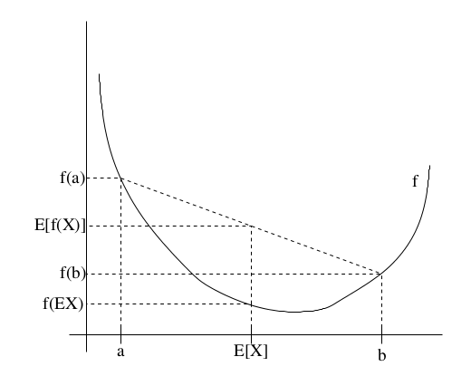
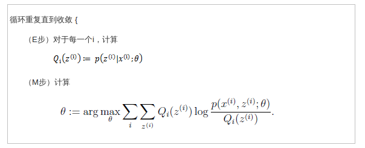
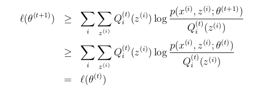
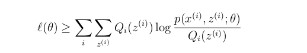
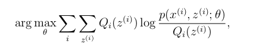
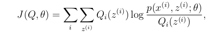

EM算法可以用于含有隐含变量的参数评估问题.		

##Jesen 不等式		
-------------

当函数f为凸函数时,我们知道$f^{\prime\prime}(x)\geq0,如果函数f的输入为向量时,则其半正定矩阵H\geq0$Jesen不等式可以描述为:		

**定理**  f是一个凸函数,X是一个随机变量,则:		

$$E[f(X)]\geq{f(EX)}$$		

并且如果f是严格凸函数($f^{\prime\prime}(x)>0),则E[f(X)]\geq{f(EX)}$当且仅当p(X)=P(EX)=1,即X是一个常数.		

通过下面的图可以有个更清晰的认知:			

如图可知f为严格凸函数,假设x有0.5的概率取值为a(p(x=a)=0.5),有0.5的概率取值为b,则变量x的期望应当为E[X]=$\frac{a+b}{2}$,期望x值应该是a和b的中点,E(f(x))=$\frac{f(a)+f(b)}{2}$,可以知道$E[f(X)]\geq{f(EX)}$,并且我们知道,只有当X取一个值的概率为1时,有$E[f(X)]={f(EX)}$

##EM算法
------------------

假设我们有一个关于m个独立样本集${x^{(i)},...,x^{(m)}}$的参数评估问题,样本集中包含了隐含变量z,我们需要估计模型P(x,z)的参数$\theta,参数\theta$的最大似然估计为:		
$$l(\theta) = \sum_{i=1}^m\log{p(x^{(i)};\theta)} \\
			=\sum_{i=1}^m\log\sum_{z^{(i)}}p(x^{(i)},z^{(i)};\theta)$$		

其中$z^{(i)}是隐含随机变量,如果z^{(i)}是可观测的$,那么通过极大似然估计便可以求得参数解.		

EM算法给出了实现参数评估的一种有效的方法,精确的最大化$l(\theta)可能很困难,这里我们可以采用如下的替代策略:在E步不断的建立l(\theta)的下界$,并且在M步优化下界.通过这两个步骤的迭代过程来实现$l(\theta)的最大化$.

假设$Q_i是变量z的分布,则有\sum_zQ_i(z)=1,_i(z)\geq0$,则可以得到:
	
$$l(\theta) = \sum_{i=1}^m\log{p(x^{(i)};\theta)}  \\
			=\sum_{i=1}^m\log\sum_{z^{(i)}}p(x^{(i)},z^{(i)};\theta) \\
			=\sum_{i=1}^m\log\sum_{z^{(i)}}Q_i{z^{(i)}}\frac{p(x^{(i)},z^{(i)};\theta)}{Q_i{z^{(i)}}}  \\
			\geq\sum_{i=1}^m\sum_{z^{(i)}}Q_i{z^{(i)}}\log\frac{p(x^{(i)},z^{(i)};\theta)}{Q_i{z^{(i)}}}$$		

公式的第三步到第四步运用到了Jesen不等式,$\log(x)函数是严格凹函数,所以E[f(X)]\leq{f(EX)},其中Q_i{z^{(i)}}表示变量z^{i}$的概率分布,$\frac{p(x^{(i)},z^{(i)};\theta)}{Q_i{z^{(i)}}}表示变量为z^{i}的函数$,第三步表示的是函数的期望,又由于函数是凹函数,所以其值要大于等于期望的函数.

现在给定了关于隐含变量的分布$Q_i,我们可以得知l(\theta)的下界,对于Q_i有许多选择,我们该如何选择呢?当我们猜测一个初始的\theta值时$,E步所要实现的就是希望我们的替换的$l(\theta)不断的贴近真实l(\theta)的下界,我们从Jesen不等式可以知道E[f(X)]={f(EX)}$的充分必要条件是x为一个常数,也就是说:		

$$\frac{p(x^{(i)},z^{(i)};\theta)}{Q_i{z^{(i)}}}=c(常数)$$		

又$\sum_{z}Q_i(z^{(i)})=1$		

$$\sum_{z}p(x^{(i)},z^{(i)};\theta)=c\sum_{z}Q_i(z^{(i)})=c$$		

可以得到:			

$$Q_i(z^{(i)})=\frac{p(x^{(i)},z^{(i)};\theta)}{\sum_{z}p(x^{(i)},z^{(i)};\theta)} \\
			  =\frac{p(x^{(i)},z^{(i)};\theta)}{p(x^{(i)};\theta)} \\
			  = p(z^{(i)}｜x^{(i)};\theta)$$

这样在初始猜测一个参数$\theta后,的出z^{(i)}在x^{(i)}和参数\theta下的后验概率分布,即可以得到隐含变量的分布Q^{(i)}$.		

##证明收敛
---------------

这里需要证明算法最终是否会收敛,假设$\theta^{(t)}和\theta^{(t+1))}为两个EM算法成功迭代的参数值,我们需要证明l(\theta^{(t)})\leq{l(\theta^{(t)})}$,如果不等式成立的话,也就是说每次迭代都使得似然估计的值变大.当我们已经通过迭代获得了$\theta^{(i)}$,我们将通过E步选择$Q_i(z^{(i)})=p(z^{(i)}｜x^{(i)};\theta),由于我们知道在E步的时候因为要建立l(\theta^{(t)})的下界$,所有根据Jesen不等式必须有:		

对上面等式的右边通过极大似然估计获得$\theta^{(t+1)}$,并且:			

		

第一个不等式是是由于:		

	

对任意的$Q^{(i)}和\theta都成立,这里设定Q^{(i)}=Q_t{(t)},\theta=\theta^{(t+1)},第二个不等式成立是因为\theta^{(t+1)}$是通过如下计算获得:			

如果我们定义:		

通过之前的推导我们知道$l(\theta)\geq{J(Q,\theta)}$,那么EM算法也可以看作是J函数上的坐标上升算法,E步相当依据猜测或上步迭代的$\theta来最大化Q_i,M步相当于根据根据Q_i优化\theta$
	
**参考内容**		

[JeeryLead(EM算法)](http://www.cnblogs.com/jerrylead/archive/2011/04/06/2006936.html)	

[Rachel-Zhang(EM算法原理)](http://blog.csdn.net/abcjennifer/article/details/8170378)		

[zouxy09(从最大似然到EM算法浅析)](http://blog.csdn.net/zouxy09/article/details/8537620)			
