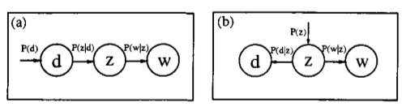
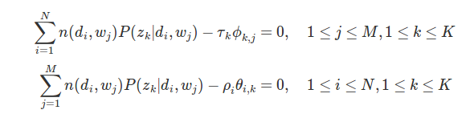

在对LSA的介绍中,我们知道LSA的核心思想是将建立的文档-词项矩阵运用SVD将高维空间映射到到隐语义空间,这样可以较好的解决同义词的问题.但语义的权重不好解释.

##1.层面模型(aspect model)
-----------

pLSA是以层面模型进行建模,层面模型是一个统计模型.它是关联于潜在类别Z的共现数据(co-occurence)的潜在变量模型.关于D*W(文档-词项)的联合概率定义如下:		

$$P(d,w) = p(d)p(w｜d),p(w｜d)=\sum_{z\in Z}p(w｜z)p(z｜d)$$

当然我们也可以对P(w,d)做如下变化:		

$$p(d,w) =\sum_{z\in Z}p(z)p(w｜z)p(d｜z)$$

用概率图表示为:		

对于图(a),d代表文档,Z代表隐变量(文档主题),W为观察到的单词.$p(d_i)表示单词出现在文档d_i的概率$,$p(z_k｜d_i)表示在文档d_i中$,		
出现$主题z_k下的单词的序列(可以理解为主题z_k也是有一系列表现此主题的单词构成)$,$P(w_j｜z_k)表示在主题z_k下出现单词w_j的$			
概率.并且每个主题上的所有词服从多项式分布,每个文档上的所有主题服从多项式分布.整个文档的生成过程为:		

* 以$p(d_i)的概率选中文档d_i$		
* 以$p(z_k｜d_i)的概率选中主题z_k$		
* 以$p(w_j｜z_k)的概率选中词w_j$		

其中$(d_i,w_j)是可以可观测值,z_k是隐变量,我们的工作便是估计P(w_j｜z_k)和p(z_k｜d_i)的参数$.

假设$\theta_i表示所有主题在文档d_i的一个多项式分布,则\theta_i可以表示成一个向量,每个元素\theta_{ik}$表示主题k在出现在文档i的概率,即:		

$$p(z_k｜d_i) = \theta_{ik}, \sum_{z_k\in Z}\theta_{ik}=1$$		

假设$\phi_k表示所有词在主题z_k上的一个多项式分布,则\phi_k可以表示成一个向量,每个元素\phi_{kj}$表示单词j出现在主题k的概率,即:		

$$p(w_j｜z_k) = \phi_{kj},\sum_{w_j\in W}\phi_{kj} = 1$$			

所以参数评估可以形式化表现为评估参数$\Theta,\Phi$:		

$$\Theta=[\theta_1,\theta_2,...,\theta_N],d_i\in D$$		

$$\Phi = [\phi_1,\phi_2,...,\phi_k],z_k\in Z$$		

由于词与词之间是相互独立的,且文档与文档之间也是相互独立的.所以我们可以得到整个语料库的词的分布:		

$$p(W｜d_i) =\prod_{j=1}^Mp(d_i,w_j)^{n(d_i,w_j)}$$		

$$p(W｜D) = \prod_{i=1}^N\prod_{j=1}^Mp(d_i,w_j)^{n(d_i,w_j)}$$		

其中,$n(d_i,w_j)表示在文档i中词j出现的次数$,当我们采用极大使然估计来实现参数评估时:		

$$l(\Theta,\Phi)=\sum_{i=1}^N\sum_{j=1}^Mn(d_i,w_j)\log{p(d_i,w_j)} \\
					  =\sum_{i=1}^N\sum_{j=1}^Mn(d_i,w_j)\log{p(d_i)\sum_{z_k\in Z}p(w_j｜z_k)p(z_k｜d_i)} \\
					  =\sum_{i=1}^N\sum_{j=1}^Mn(d_i,w_j)(\log{p(d_i)+\sum_{z_k\in Z}\theta_{ik}\phi_{kj}})$$		

显然,对于含有隐变量的极大使然估计,因为我们不知道隐变量的分布,所以极大似然估计方法得不到参数解.这里我们可以采用EM算法进行参数评估.		

##2.EM参数评估
-----------

EM算法可以用于含隐变量的参数评估,它是一种近似求解方法,主要是通过迭代的方法来获取近似最优解.每次迭代包含E步和M步,E步是要建立极大似然函数的下界,求得隐变量的后验分布.M步则是根据隐变量的后验分布来优化要估计的参数.

###E步

在pLSA的参数估计中,可见变量是d和w,隐含变量是主题z,所以隐含变量关于d和w的后验概率为:		

$$p(z_k｜d_i,w_j) = \frac{p(z_k,d_i,w_j)}{\sum_{z_k\in Z}p(d_i,w_j,z_k)} \\
				 =\frac{p(d_i)p(z_k｜d_i)p(w_j｜z_k,d_i)}{\sum_{z_k\in Z}p(d_i)p(z_k｜d_i)p(w_j｜z_k,d_i)} \\
				 =\frac{p(z_k｜d_i)p(w_j｜z_k)}{\sum_{z_k\in Z}p(z_k｜d_i)p(w_j｜z_k)} \\
				 =\frac{\theta_{ik}\phi_{kj}}{\sum_{z_k\in Z}\theta_{ik}\phi_{kj}}$$		

		
在第一次的迭代时,会基于猜测或其他方法假定参数$$\theta_{ik},\phi_{kj}$$的值.这样便能获得隐变量的后验分布.		

###M步 		

在M步,将E步得到的隐变量的后验分布代入似然估计中,通过极大似然估计,更新参数$$\theta_{ik},\phi_{kj}$$的值.似然函数的期望为:			

$$E[l]=\sum_{i=1}^N\sum_{j=1}^Mn(d_i,w_j)\sum_{k=1}^Kp(z_k｜d_i,w_j)log[\theta_{ik}\phi_{kj}]$$		

这是一个多元函数求极值的问题,其中约束条件有:		

$$\sum_{z_k\in Z}\theta_{ik}=1$$		
	
$$\sum_{w_j\in W}\phi_{kj} = 1$$			

将问题转化成拉格朗日乘法,得到的拉格朗日函数为:			

$$H=E[l]+\sum_{k=1}^K\gamma_k(1-\sum_{j=1}^M\phi_{kj}+\sum_{i=1}^N\rho_i(1-\sum_{k=1}^K\phi_ik)$$		

这是一个关于$$\theta_{ik}和\phi_{kj}$$的函数,分别对其求偏导,得到:		

		

最后求出期望最大化的新的参数值为:			

		

##3.总结
-------------

从前面的推理来看,pLSA和LSA好像并没有什么联系.LSA是基于向量空间模型的SVD分解来进行隐空间投射,来挖掘文档之间的语义层的联系.而pLSA模型是基于层面模型的关于潜在变量的统计建模过程.我们知道pLSA是在文档和词项之间加入了一层隐含变量(主题),我们不妨做如下假定:		

$$U=(p(d_i｜z_k))_{i,k},V=(p(w_j｜z_k))_{j,k},\overline\sum=diag(p(z_k))_k$$		

则有$$p=U\overline\sum V=(\sum_kp(d_i｜z_k)p(z_k)p(w_j｜z_k))_{i,j}=(p(d_j,w_j))_{i,j}$$,可见,			
$$[U,\overline\sum,V]正是p的svd分解,p(z_k)是p的k个特征值.$$		

不同的是,LSA使用特征值进进行SVD分解,则实际上是L2范数意义下对N的最好估计,而pLSA使用EM算法,使似然函数的期望达到最大.并且,pLSA的P矩阵有明确的统计意义,而LSA的这种意义不明显.

###参考内容:

[主题模型之pLSA   http://blog.jqian.net/post/plsa.html](http://blog.jqian.net/post/plsa.html)		

[pLSA及EM算法    http://blog.csdn.net/yangliuy/article/details/8330640](http://blog.csdn.net/yangliuy/article/details/8330640)

