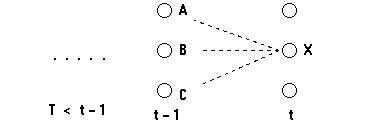

##1.介绍
---------

隐马尔可夫模型(Hidden Markov Model,HMM)是一种统计模型,用它来描述一个含有未知参数的马尔可夫过程.在模型中包括可观察的参数和隐藏的参数,一般要求解的问题是通过观察到的参数来评估过程中的隐含参数.隐马尔可夫模型在语音识别,中文分词,词性标注,机器翻译等领域都有十分广泛的运用.		

###模型表示

隐马尔可夫模型(HMM)可以用如下的五元组来表示,包括2状态集合和概率矩阵:

(1).隐含状态S={$s_1,s_2,...,s_n$}		

隐含状态是马尔可夫模型中所隐含的状态.这些状态无法通过直接观测而得到.		

(2).可观测状态O={$o_1,o_2,...,o_m$}				

可观察状态是马尔可夫模型中可以观测到的状态.(可观察状态数目和隐含状态数目可以不相等).		

(3).初始状态概率矩阵$\pi$			

表示隐含状态在初始时刻t=1时的概率矩阵.初始状态概率矩阵为$\pi=[p(s_1),p(s_2),...,p(s_n)]$		

(4).隐含状态的概率转移矩阵$A_{ij}$		
表示在HMM模型在各个隐含状态之间的转移概率.其中$$A_{ij}=p(s_j｜s_i)$$表示在t时刻隐含状态为$s_i时,t+1时刻隐含状态为s_j$的概率.		

(5).隐含状态到观察状态的概率转移矩阵$$B_{ij}$$	

$$B_{ij}=p(o_j｜s_i)$$表示在隐含状态$s_i的情况下,观察状态为o_j$的概率.		

###实例

考虑这样一个例子,有一个隐士,他不知道自己所在地的天气情况(天晴,下雨,多云,对应于隐含状态S).但是他养了一株水藻,他可以观察到水藻的状态(干燥,湿润,湿透,对应于观察状态O).并且对每一个天气,水藻呈现不同状态的概率已知,例如天晴时水藻干燥,湿润和湿透的概率(对应于隐状态转移矩阵A)分别为0.4,0.3,0.3.同时你知道,今天的天气情况下明天的天气情况的概率(如今天天晴时,明天天晴,下雨,多云的概率分别为0.5,0.1,0.对应于观察状态在应状态下的概率转移矩阵B).并且,我们假定从以某一天为开始,这一天的天气情况概率分布(对应于初始概率$\pi$)我们也知道.		

假设隐士观察了水藻一个礼拜,这一个礼拜水藻的状为(干燥,干燥,湿润,湿润,干燥,湿透,干燥).现在问题来了,你能不能计算出这一系列状态出现的概率?能不能计算出隐士所在地方这一个礼拜最可能天气情况?	

带着这些问题你将更好的理解HMM模型的应用.

###基本问题

HMM可用于解决如下三个问题:

1.评估问题(evaluate) 		

给定观察序列$O=o_1o_2...o_t和模型参数\lambda=(S,O,A,B,\pi)$,计算在HMM模型下观察序列出现的概率.运用前向算法(forwad algorithm)进行求解.	

2.解码问题(decode)

给定观察序列$O=o_1o_2...o_t和模型参数\lambda=(S,O,A,B,\pi)$,根据观察序列计算对应的最有可能的隐状态序列.在实际问题中,我们往往更关心的是马尔可夫模型中的隐含状态,可以运用viterbi算法进行求解.		

3.学习问题 		

HMM模型的参数$\lambda=(A,B,\pi)$未知,如何调整这些参数以使得观察序列O的概率尽可能的大,通常采用Baum-Welch算法解决.	

下面我们详细讨论这3个问题.	

##2.评估问题(evaluate)
-----------

假设模型参数$\lambda=(A,B,\pi)$已知,考虑上面提到的例子,假设3天间我们观察到的水藻状态为(干燥,湿润,湿透),这三天中的任一天都可能是多云,晴天或是雨天,对于观察序列及隐藏序列,我们可以用如下的网格来表示:			

			

网格中的每一列表示可能的天气状态,并且每一天中的每个天气都与一个到相近天气状态相连,表示为在当前天气状态下到下一个天气状态的概率.每一列的下面是某个时间点上的观察状态.我们发现,对于如上的描述,这三天可能出现的天气序列有$3^3$=27种,这27种天气情况转化为观察序列的概率和便是观察序列在模型下出现的概率,表示为:

$$P(O｜HMM) = p(O｜sunny,sunny,sunny)+p(O｜sunny,sunny,rainy) \\
+...+P(O｜cloudy,cloudy,cloudy)$$	

$O=(dry,damp,soggy)$,即为观察到的状态序列.这种基于穷举的方法求解效率很低,假设观察序列长度为T,隐含状态数目为N,所有可能的状态序列为$N^T$,没一个状态序列的时间复杂度为$O(T)$,所以总时间复杂度为$O(TN^T)$.		

下面采用前向算法(foward algorithm)进行优化求解.		

###局部概率
首先定义局部概率(partial probability),它是指到达某个中间状态的概率.

对于观察序列$O=o_1o_2...o_n,o_i可以理解为t=i时刻观察到的观察状态$,关于观察状态和隐含状态用网格表示为:	

		

那么t=2时,隐状态为"cloudy"的局部概率可以表示为:		

	

公式表述为$\alpha_{t=2}(c)=p(damp｜c)*(p(c｜s)+p(c｜c)+p(c｜r))$,其中c,r,s分别是cloudy,rainy和sunny的简称.		

那么延伸一下,假设有N个隐含状态,这t+1时刻处于隐含状态j的隐含概率可以表述为:		

	

$$\alpha_{t+1}(j) = b(o_{t+1}｜j)\sum_{i=1}^N\alpha_t(i)a_{ij}$$		

其中$$b(o_{t+1}｜j)$$表示的是在t+1时刻,观察到的状态$$o_{t+1}$$在隐含状态j下的概率,$$a_{ij}$$表示隐含状态i到j的转移概率 .

在t=1时,没有路径指向当前时间的隐含状态,t=1时的局部概率定义为:		

$$\alpha_{1}(j)=b(o_1｜j)\pi(j)$$	

在我们求出t=1时个隐含状态的局部概率之后,就可以递归的计算t=2,t=3,...时各个隐含状态的局部概率,直到求得t=T(T为观察序列的长度)时为止.

在t=1时,求每个隐含状态的局部概率时间复杂度为O(1),在t>1时,球每个隐含状态的时间复杂度为O(N),则t>1时求每一列的时间复杂度为O(N*N),T为观察序列的长度,则前向算法的时间复杂度为O(TN^2).	

##3.解码问题(decode)	
-------------------

假设模型参数$\lambda=(A,B,\pi)$已知,考虑上面提到的例子,假设3天间我们观察到的水藻状态为(干燥,湿润,湿透),需要求解与观察状态对应的最有可能的隐含状态序列.对与上面描述的天气的例子,其网格图为:	

		

可以知道,最有可能的天气(隐含)序列是每一列中天气组合(总共27种)中的一项,所以最有可能的隐含序列$\hat S$可以表述为:	

$$\hat S=argmax_{s\in S}p(O｜s)$$

$$其中观察O=(dry,damp,soggy),s为27种隐含序列中的一种$$		
同样,我们可以通过穷举法计算每一种可能出现的隐状态序列的概率,概率值最高的便是要求的隐含状态序列.这显然又是十分耗时的工程,我们可以采用viterbi算法优化求解.		

###局部概率和局部最佳路径		

对于上面的程序,先假设在t=3时,天气状态为cloudy时概率最大,那么从t=2到t=3的cloudy状态有3条路径,最佳路径必定是这三条路径中的一条.假设t=2时的从状态rainy到t=3的cloudy的概率最大,则可以说明t=2时的cloudy路径为局部最佳路径,路径对应的概率称为局部概率($\delta$).

延伸一下,假设有N+1个隐含状态,在t+1时刻的位于隐含状态j的局部概率为:	

$$\delta_t(j) = max_{i \in N}(\delta_{t-1}(i)a_{ij}b_{jo_t})$$	

其中$b_{jo_t}指的是在t时刻的观察值o_t在隐含状态j下的概率$,在t=1时,没有路径指向当前的隐含状态,其局部概率为:		

$$\delta_1{j} = b_{jo_1}\pi(j)$$		

这样通过计算t=1时各个隐含状态的局部概率,就可以计算t=2,...t=T时各状态的局部概率.其实,在t=T时,计算出来概率$\delta_t(j)$便是最后与观察序列对应的且最后一个隐含状态为j的最终概率,$$j=max_{j\in N} \delta_t(j)$$可以求出最后一个观察状态对应的隐含状态.那么如何求之前T-1个观察状态对应的隐含状态?这里我们需要借用反向指针来实现.		

我们知道计算t时刻隐含状态j的局部概率$$\delta_{t}(j)$$,需要的知道t-1时刻的$$\delta_{t-1}$$,我们需要记录t-1时刻的某个状态i,有i状态到达t时刻的状态j是到达状态j的最佳路径.通过反向指针来记录这种状态:		

$$\phi_t(j) = argmax_{i\in N}(\delta_{t-1}(i)aij)$$		

其中,$$\phi_t(j)表示指向t时刻状态j的隐含状态,具体所指应该是t-1时刻的某个状态i$$.		

其实初看这个公式的有些奇怪,我们在计算局部概率$\delta$的时候,同时考虑了局部概率$\delta和转移概率a及混淆概率(从隐含概率到观察概率,b)$.这是因为,我们希望$\phi$可以能回答这个问题"如果我们在这里,最可能通过哪条路径到达下一个状态?",这个问题与隐藏有关,而与观察状态无关,故而可以忽略混淆矩阵的影响.		

###小结

viterbi算法提供了一种有效的计算方法来分析HMM模型的观察序列,并捕获最有可能的隐藏序列.它利用递归减少计算两,并使用整个序列的上下文来做判断,从而对包含"噪声"的序列也能进行良好的分析.		

在使用时,viterbi算法对于网格中的没一个隐状态都计算一个局部概率,同时包含一个反向指针来指示最有可能的到达该单元的路径.当完成整个计算之后,首先在终止时刻找到最可能的隐含状态,然后通过反响指针回溯到t=1时刻,这样回溯路径上的状态序列就是最可能的隐含状态序列.		

##4.学习问题 		
-------------

如果模型参数的先验分布已知,也就是参数$\lambda=(\pi,a,b)$已知的情况下,对于某一观察序列,可以计算出观察序列出现的概率及与观察序列对应的最有可能的隐含序列.如果模型的参数事先并不知道,那么能够在给定某一观察序列的情况下估计模型的参数?

这种情况下,我们可以用极大似然估计来估计模型参数,问题可以定义为:		

$$\lambda=argmax_{\lambda}l(O｜\lambda) \\
		 =argmax_{\lambda}\sum_{i=1}^T\log p(o_t｜\lambda) \\
		 =argmax_{\lambda}\sum_{i=1}^T\log \sum_{s_t} p(o_t,s_t｜\lambda)$$		
其中$\lambda$是HMM模型的参数集合,O是观察序列,长度为T.$s_t$表示t时刻可能的隐含状态.		

由于含有隐变量,很难通过极大似然估计获取参数解.对于这一类含有隐变量的参数估计问题,可以采用EM算法进行参数评估.		

这里我们主要采用前向-后向算法(Forward-backward algorithm)算法进行问题的近似求解,前向-后向算法是EM算法的一个特例.		

这具体讲解之前,先引入几个概念:

首先我们已经知道前向变量$\alpha$的意义,$$\alpha_t(j)$$表示t时刻位于隐含变量j的局部概率.		

$$\alpha_1(j) = \pi(j)b_j(o_1),t=1$$		

$$\alpha_{t+1}(j) = b_j(o_{t+1})\sum_{i=1}^N\alpha_t(i)a_{ij},t>1$$		

类似的,我们可以定义后向变量$\beta$,$\beta_t(j)表示观察序列o_{t+1}...o_T$在t时刻隐含变量为j的概率,形式话定义为:		

$$\beta_t(j) =p(o_{t+1}...o_T｜q_t = s_j;\lambda),i\leq t\leq T,1\leq j\leq N$$	

初始化,令t=T时刻的所有状态的后向变量为1:		

$$\beta_T(j) = 1,1\leq j\leq N$$

当t<T时,通过下图t和t+1时刻的隐含变量之间的关系可以的出t时刻的后向变量为:		

		

$$\beta_t(j) = \sum_{i=1}^N\beta_{t+1}(i)a_{ji}b_i(o_{t+1}),1\leq j\leq N,1\leq t\leq T-1$$		

给定观察序列O和HMM模型,定义t时刻处于隐含状态$s_j$的概率变量为:		
 
$$\gamma_t(j) = p(q_t=s_j｜O,\lambda) \\
			  =\frac{\alpha_t(j)\beta_t(j)}{p(O｜\lambda)} \\
			  =\frac{\alpha_t(j)\beta_t(j)}{\sum_{i=1}^N\alpha_t(j)\beta_t(j)}$$

其中分母的作用是确保$$\sum_{i=1}^N\alpha_t(j)\beta_t(j)=1$$			

给定观察序列O和HMM,定义t时刻处于隐含状态$s_i$,且t+1时刻处于隐含状态$s_j$的概率变量为:		

$$\xi_t(i,j) = p(q_t=s_i,q_{t+1}=s_j｜O,\lambda) \\
			 = \frac{\alpha_t(i)a_{ij}\beta_{t+1}(j)b_{j}(o_{t+1})}{p(O｜\lambda)} \\
			 =\frac{\alpha_t(i)a_{ij}\beta_{t+1}(j)b_{j}(o_{t+1})}{\sum_{i=1}^n\sum_{j=1}^N\alpha_t(i)a_{ij}\beta_{t+1}(j)b_{j}(o_{t+1})}$$		

并且,$$\gamma_t(i) = \sum_{j=1}^N\xi_t(i,j)$$		

现在回到参数的求解过程中来.		

EM算法是一个迭代的过程,通过迭代来执行E步和M布来达到参数的近似最优解.具体到我们的问题中,E步得到隐变量的概率分布(通过隐变量的后验概率).在实现过程中,我们知道与隐变量相关的是隐变量概率转移矩阵和观察状态在隐变量下的混淆矩阵.所以按照如上的方式计算$$\gamma_t(i)和\xi_t{i,j}$$	

在M步中,需要更新模型参数:		

$\overline\pi_(i)$是在初始时刻出现状态i的频率的期望值,$\overline\pi_(i)=\gamma_1(i)$		

$$\overline\alpha_{ij}$$是从状态i转移到状态j的次数的期望值/从状态i转移出去的次数的期望值:		

$$\overline\alpha_{ij}=\frac{\sum_{t=1}^{T-1}\xi_t(i,j)}{\sum_{t=1}^{T-1}\gamma_t(i)}$$	

$\overline b_j(k)$是在状态j下观察到的可观察状态k的次数的期望/从状态j下观察到的所有可观察状态的次数的期望		

$$\overline b_j(k) =\frac{\sum_{t=1,s.t.o_t=k}^T\gamma_t(j)}{\sum_{t=1}^T\gamma_t(j)}$$

###参考内容

[我爱自然语言处理-隐马尔可夫模型](www.52nlp.cn/category/hidden-markov-model)

####维基百科-隐马尔可夫模型			

[HMM实现源码(python) github.com/jwchennlp/HMM](https://github.com/jwchennlp/HMM)

[前向-后向算法(forward-backward algorithm) http://www.cnblogs.com/zhangchaoyang/articles/2220398.html](http://www.cnblogs.com/zhangchaoyang/articles/2220398.html)

