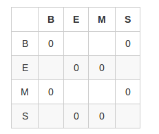
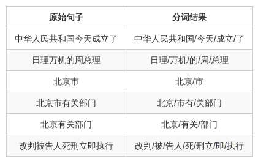

##1.介绍
-----------------

通过之前隐马尔可夫模型(HMM)的讲解及其适用问题的分析,对HMM应该有一个大致的认知.同时,我们知道HMM在很多领域都有运用.现在我们具体实现HMM在中文分词中的运用.		

中文分词 (Chinese Word Segmentation) 指的是将一个汉字序列切分成一个一个单独的词.我们知道,在英文中单词是以空格作为分割符的,而中文中每个字之间都是紧密挨着的,所以中文的分词则要显得困难很多.

当前的中文分词主要有一下3个方向:

1.基于规则的分词

也就是说可以按照某些规则规则去匹配句子中符合某一规范的词,较为常见为构造一个词典,在对句子遍历的过程中,查看词是否出现在句子中.按照扫描方法可以分为正向匹配和逆向匹配.按长度不同可以分为最大匹配和最小匹配.		

2.基于统计的分词 	

首先给出大量已经分好词的文本,利用统计机器学习模型学习词划分的规律,从而实现对未知文本的词划分.		

3.统计和规则相结合的分词

##2.实现
----------------

这里用到的是[SIGHAN](http://sighan.cs.uchicago.edu/bakeoff2005/)里面的语料.

中文分词问题可以理解为,给定一个句子(S=$s_1s_2...s_n$),我们需要找出最有可能的一个分词策略.如北京市有关部门,理想的分词结果应该是"北京市/有关/部门".这里需要考虑一个问题,如果采用HMM,未分词的句子是观察状态(O),则隐含状态(S)是什么呢?

这里我们定义隐含状态的4个类别State={B,E,M,S}:

B:一个词的开始	
E:一个词的结束		
M:一个词的中间		
S:单字成词		

这是北京市有关部门的分词结果可以表示为"BMEBEBE".	

定义好隐含状态之后,我们发现对每个句子的最有可能的分词策略便是找出最可能的隐含状态序列,这是HMM中讲到的解码(decode)问题.	

HMM模型定义为一个五元组$$\lambda=(S,O,\pi,a,b)$$其中S为隐含状态集合,O为观察状态集合,$\pi$为隐含状态的初始概率,a为隐含状态的转移概率,b为在从隐含状态到观察状态的混淆概率(发射概率).现在要做的就是根据已经表述好的文本语料的出各参数的值.

$$\pi=P(S)=[p(B),p(E),p(M),p(S)]$$		

$$a_{ij}=P(s_j｜s_i)=\frac{count(s_i,s_j)}{count(s_i)},1\leq i\leq N-1;N为隐状态长度$$		

$$b_{it}=p(o_t｜s_i)= \frac{count(s_i,o_t)}{count(s_i)},1\leq i\leq N;1\leq t\leq T,T为观察状态长度$$

对于已经分好词的预料,对于某一篇文档d={$$o_1o_2,...,o_{n(d)}$$},有相应的标注结果$$s_1s_2,...,s_{n(d)}$$

根据文档信息和表标注息可以得出预料中某词$o_t$对应于隐状态$s_i$的次数,$count(o_t,s_i)$,当前词对于的隐状态为$s_i$,下一词对应隐状态$s_j$的次数,$count(s_i,s_j)$

由于文档开始的第一个词隐状态只能是B或者是S,所以只需要计算P(B)和P(S),$P(B)=\frac{count(B)}{count(B)+count(S)}$.

在计算隐含状态的转移概率时,B-B,B-S,E-E,E-M,M-B,M-S,S-E,S-M都为0,所以只需要计算剩下的8种组合.	

<!--
|		|B 		|E 		|M 		|S 		|		
|:-----:|:-----:|:-----:|:-----:|:-----:|
|	B	|	0 	|		|		|	0	|
|	E	|		|	0	|	0	|		|
|	M	|	0	|		|		|	0	|
|	S	|		|	0	|	0	|		|	
-->

由于b计算的是隐含状态-观察状态矩阵,首先我们的观察状态集合该如何定义呢?		

观察状态集合可以理解为字的集合,因为分好词的语料库很难包含所有的字,所以理想状态是用分好词的语料库和待分词的文档集合的所有字构成观察状态集,但是在计数($count(o_t,s_i)$)时只基于分好词的语料库技术.这样将导致那些只出现在待分词文档中的词的混淆概率为0,这样使得在viterbi算法过程中包含此词的句子的$\delta值0$,无法求得隐含序列.

对于这种情况,可以采用平滑技术进行处理,这里我们采用的是加1平滑,效果更好的可以采用[good-turing平滑](http://zh.wikipedia.org/wiki/%E5%9B%BE%E7%81%B5%E4%BC%B0%E8%AE%A1).所以:

$$b_{it}=p(o_t｜s_i)= \frac{count(s_i,o_t)+1}{count(s_i)},1\leq i\leq N;1\leq t\leq T,T为观察状态长度$$	

在计算好参数{$\pi,a,b$}之后,采用上节实现的viterbi算法求解.采用SIGHAN的评测标准,P=80.3%,R=78.6%,F_1=79.5%	

如下为部分句子的分词结果:

<!--
|原始句子|分词结果|
|:-----:|:----:|
|中华人民共和国今天成立了|中华人民共和国/今天/成立/了|
|日理万机的周总理|日理/万机/的/周/总理|
|北京市|北京/市|
|北京市有关部门|北京/市有/关部门|
|北京有关部门|北京/有关/部门|
|改判被告人死刑立即执行|改判/被/告人/死/刑立/即/执行|
-->

可以看出来,正常情况的分词效果还是比价理想的.不过当长词(北京市)及长词里面有短词时(北京),分类效果有时会倾向于分成短词,并在后续的分词结果中出错.

##4.注意的问题
--------------

正常情况下一个词的混淆概率$p(o_t｜s_i)$应该很小.在viterbi算法中t+1时刻位于隐含状态j的局部概率为:		

$$\delta_t(j) = max_{i \in N}(\delta_{t-1}(i)a_{ij}b_{jo_t})$$	

可以看出,当长度为N的观察序列的$\delta$值需要累乘N个混淆概率,这很容易使得$\delta$值为0. 这里我们可以用对数的方式来$\log\delta来替代\delta$或者对于一篇文档,我们可以按标点符号进行分割,计算每个分割后的子文档的隐含序列.最后将隐含序列进行累加即可.		

